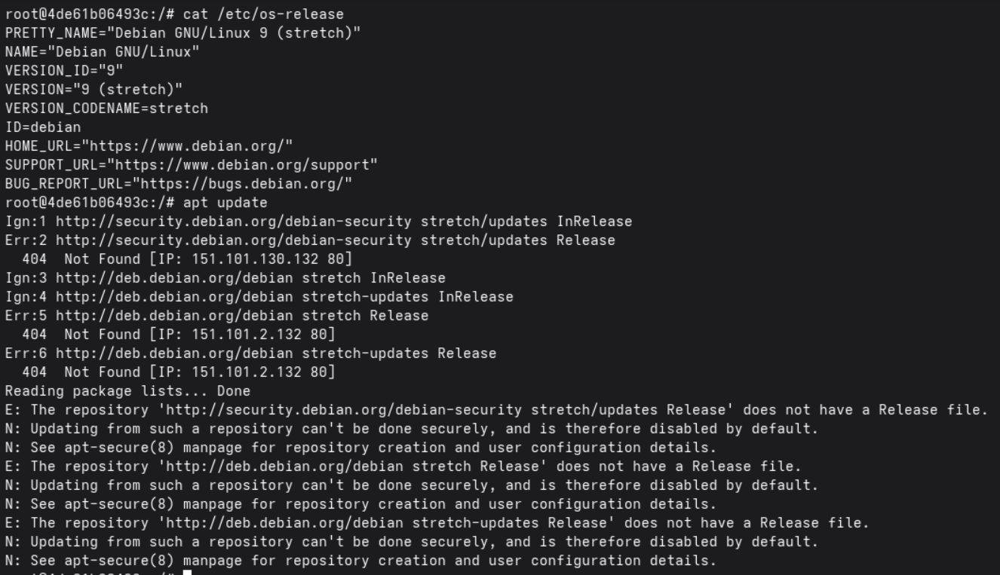
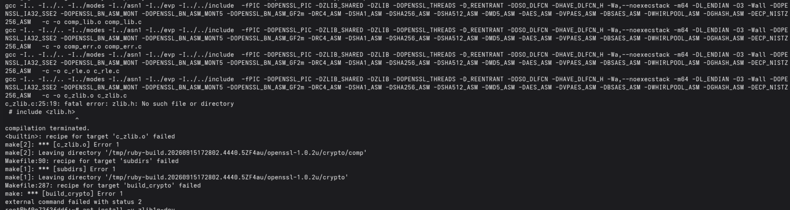
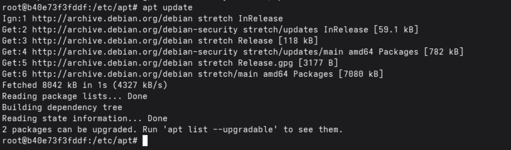

# ruby on rails (debian stretch)

- 

## versions

- ruby 2.3.8p459 (2018-10-18 revision 65136) [x86_64-linux]
- rails 4.2.6

## debugs erros

- pull docker debian stretch

```sh
docker pull debian:stretch
```

- docker run debian stretch

```sh
docker run --rm --name debian-stretch -it debian:stretch
```

- update source list

```sh
apt update
```

- found errors



- solution, edit sources.list to use archive.debian.org

```sh
sed -i '/stretch-updates/d' ./sources.list
sed -i 's|deb.debian.org|archive.debian.org|g; s|security.debian.org/debian-security|archive.debian.org/debian-security|g' ./sources.list
```

- rbenv error

```sh
rbenv install 2.3.8
```



- verify sources.list

```sh
cat sources.list
```

- update packages

```sh
apt update
apt upgrade -y
```

- please install the following packages

```sh
apt install -y \
    git \
    curl \
    build-essential \
    gcc \
    g++ \
    make \
    zlib1g-dev
```



# dockerfile debian stretch ruby on rails

- base image

```sh
docker pull debian:stretch
```

- build docker image

```sh
docker build \
    -f ./debian-stretch-ruby-on-rails.Dockerfile \
    -t ruby:2.3.8 \
    --progress=plain \
    .
```

## references

- check out [debian archive](https://www.debian.org/distrib/archive)
- check out [fix apt-get 404 errors debian](https://www.tecmint.com/fix-apt-get-404-errors-debian/)
- check out [install ruby on rails](https://guides.rubyonrails.org/install_ruby_on_rails.html)
- check out [ruby on rails version 4.2.6](https://guides.rubyonrails.org/v4.2.6/)
- check out [ruby 2.3.8](https://guides.rubyonrails.org/v2.3.8/)
- check out [ruby build plugins for install ruby](https://github.com/rbenv/ruby-build#readme)
